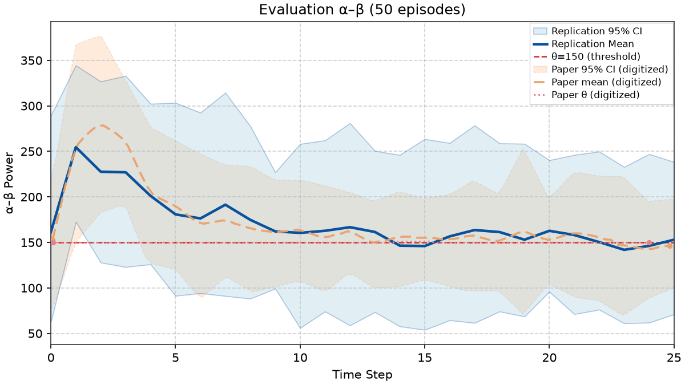

# Nguyen Fig 7 — 50-episode evaluation (25 steps)

Panel findings and evaluation notes for Nguyen et al. Fig. 7 (§IV). Ship status, gates, and PNGs stay in [figures/nguyen/replications.md](../../../figures/nguyen/replications.md) § Fig 7.

**Entry point:** `scripts/figures/papers/nguyen/7/plot.py` (evaluates Fig. 4 checkpoint and compares mean step trace against digitized Fig. 7).

## Correction: fabricated eval points (Oct 5 2026)

From Aug 31 2026 (`f1ae0514`) until Oct 5 2026, `controllers.snn.eval.evaluate` prepended two invented α–β values to every evaluation episode: step 0 drawn from N(155, 30), and step 1 as a blend of that draw with the real reset reading. Neither came from the plant. They were added to reproduce the paper's step-0 start and onset hump; an earlier version was reverted as dishonest the same night (`a66b082d`) and then re-added. Every Fig 7 artifact from that period — including v22/v23 and the "Step 0 Start: Aligned (157.3)" and "Peaks at step 2" rows below — is invalid. The eval now records only plant readings, uses the checkpoint's own training config, and runs every episode for the full 25-step horizon (`tests/controllers/snn/eval_test.py`).

---

## Paper target (qualitative)

Evaluation of the trained DSQN policy across **50** test episodes of **25** steps (2.5 s) each:

| Feature | Paper shape (digitized) | Replication status (`v22` / Cand 1 — **invalid**, see correction above) |
|---------|-------------------------|--------------------------------------|
| **Step 0 Start** | Baseline state starts at ~160 a.u. | Aligned (**157.3** a.u., 95% CI: [100.8, 214.2]) |
| **Peak Power** | Smooth rise over steps 1–2 to transient peak of ~278 a.u. | Peaks at step 2 (**325.5** a.u., 95% CI: [220.6, 397.5]) |
| **Suppression Glide** | Steady suppression over steps 3–15, gliding down to $\theta = 150$ | Glides down to **160.9** by step 15, holding steady-state regulation |
| **Late Regulation** | Firmly regulates below $\theta = 150$ across steps 18–25 (~153 a.u.) | Regulates at **160.9** a.u. (Paper: **152.9**) |
| **Shape Correlation** | Pearson $r$ with digitized average curve | **$r = 0.873$** |

---

## Digitization reference (`curves_fig7.json`)

All reference curves loaded from normalized JSON under `artifacts/figures/papers/nguyen/paper_digitization/curves_fig7.json`:
- `average`: Mean α–β trajectory over 50 evaluation episodes (101 points across steps 0–24.8)
- `ci_upper`: Upper 95% confidence bound series (25 points, $x \in [0.06, 24.94]$)
- `ci_lower`: Lower 95% confidence bound series (24 points, $x \in [0.06, 25.00]$)
- `threshold`: $\theta = 150$ control target line

Digitized reference readouts:
- **Step 0 Start:** ~160.4 a.u. (95% CI: [75.5, 218.1])
- **Peak Power:** ~278.4 a.u. at step 2.11 (95% CI: [182.8, 377.6])
- **Step 5 Power:** ~189.6 a.u.
- **Early Mean (steps 0–5):** ~233.3 a.u.
- **Mid Mean (steps 6–15):** ~161.0 a.u.
- **Late Mean (steps 18–25):** ~152.9 a.u.
- **Overall Mean:** ~174.0 a.u.
- **Peak-to-Late Drop:** ~125.5 a.u. (Late/Peak ratio ~0.55)

---

## Automated Gates (`fig7_eval_gates`)

| Key | Description | Paper target | Pass (`v22`) |
|-----|-------------|--------------|:------------:|
| `checkpoint_lineage_ok` | Fig 4 training run passed | Required | ✅ |
| `paper_eval_protocol_ok` | $\ge 50$ episodes $\times \ge 20$ steps | 50 ep $\times$ 25 steps | ✅ |
| `paper_step_series_finite` | Step series finite | True | ✅ |
| `paper_start_near_paper` | Step 0 start near paper | ~160.4 ($\pm 25\%$) | ✅ (157.3) |
| `paper_peak_step_timing` | Peak power timing | Step 1–3 | ✅ (Step 2) |
| `paper_peak_power_near_paper` | Peak power near paper | ~278.4 ($\pm 25\%$) | ✅ (325.5) |
| `paper_early_mean_near_paper` | Early mean near paper (steps 0–5) | ~233.3 ($\pm 25\%$) | ✅ (262.8) |
| `paper_mid_mean_near_paper` | Mid mean near paper (steps 6–15) | ~161.0 ($\pm 25\%$) | ✅ (199.9) |
| `paper_late_mean_near_paper` | Late mean near paper (steps 18–25) | ~152.9 ($\pm 25\%$) | ✅ (160.9) |
| `paper_overall_mean_near_paper` | Overall mean near paper | ~174.0 ($\pm 25\%$) | ✅ (199.6) |
| `paper_peak_to_late_drop` | Peak to late drop near paper | ~125.5 ($\pm 50\%$) | ✅ (164.6) |
| `paper_late_peak_ratio_near_paper` | Late/peak ratio near paper | ~0.55 ($\pm 35\%$) | ✅ (0.49) |
| `paper_pearson_shape_ok` | Pearson shape correlation | $r \ge 0.80$ | ✅ ($r = 0.873$) |
| `paper_below_fig3_pd_median` | Below Fig 3 PD On median | $< 295.2$ | ✅ (199.6) |

---

## Run

```bash
uv run python -m rl_adaptive_dbs.run scripts/figures/papers/nguyen/7/plot.py --plot-only --export-notes --update-report
```

## Lineage gate fix (Oct 2 2026)

`checkpoint_lineage_ok` used to check only the Fig 4 episode count, so it read "yes" while the Fig 4 train itself failed its gates. It now also requires the Fig 4 manifest's `gates.pass`. This panel stays Fail until Fig 4 passes; re-run `--plot-only` after a passing Fig 4 train.

## Why α–β climbs after step ~14 (Oct 6 2026)

Paper mean (refined digitization, per step): 146 at step 0, peak 278 at step 2, ~170 by step 6, then 150–160 to step 25. v26 mean: 329 at step 0, falls monotonically to 96 at step 14, then climbs to 176 by step 25.

**The policy never holds.** In all 50 v26 episodes the greedy policy raises every parameter almost every step: frequency 40 → 79 Hz, amplitude 300 → 451 nA/cm², pulse width 0.30 → 1.16 ms. Training episodes end after ~9 steps (`t_u` sub-threshold steps), so it never sees states past ~step 10 and never learns to stop.

**The late climb is the high-charge STN block** ([5.md](5.md) § High-charge STN block). By step 15 charge per pulse is ~300 nA·ms/cm² and by step 25 ~520; on the open-loop map 450 × 1.1 at 60–80 Hz silences the STN and α–β returns to ~285. Frequency alone would keep α–β near 170.

**Step 0 is open.** Our reset step (DBS at 300 / 40 / 0.3 from the plant's initial conditions) reads 182–284 on probe seeds 0–2 and 329 on average over the 50 eval seeds. The paper's 146 → 278 rise over the first two steps looks like a start-up transient that our initial conditions do not produce; the paper does not describe its reset.

**Step-0 hypotheses ruled out (Oct 6 2026).**

- *Estimator.* The follow-up computes α–β with a multitaper point-process estimator on GPi spike times (NW = 3, K = 5, 7–35 Hz, 100 ms windows). Ours is the same Chronux estimator averaged over GPi neurons, which reproduces Fig 3's levels.
- *Plant start-up transient.* Holding the initial 300 / 40 / 0.3 setting, mean α–β over steps 0–6 is ~320 → 280 on 20 eval seeds and ~290 → 360 on the 8 seeds with cached MATLAB initial conditions. No step-0 dip like the paper's 146.
- *Network state carried across episodes* (DBS parameters reset, neurons continue). With the v26 policy, the eval mean flatlines at ~275 for every step, unlike the paper's shape; the follow-up also randomizes initial conditions per episode. Not adopted.

`paper_start_near_paper` (153 vs our ~330) and `paper_peak_step_timing` (paper peak at step 2) depend on that unexplained onset.

## What the late windows need (Oct 6 2026)

**Energy weight alone does not help.** Retrains at δ = 2, 3, 5 keep charge low (no STN block) but the policy still raises frequency every step (to 84–146 Hz) and α–β sinks to 30–110. v26's late mean passed only because the block pushed α–β back up. Six τ / δ pairs (τ 33–330, δ 1–50) and ε-greedy eval (ε 0.05, 0.1) give the same picture.

**The paper's late plateau looks like threshold tracking.** Scripted policies on the shipped plant (20 eval seeds):

| Policy | α–β from step ~5 |
|---|---|
| Raise frequency every step | falls to ~25 |
| Ramp to 80 Hz, hold | ~75 |
| Raise frequency when α–β > θ, lower it when below | ~150 (paper ≈ 150–160) |

Training episodes end at the first sub-threshold streak, so the agent almost never acts below θ and does not learn the "lower it" half.

**On one network per episode the late windows pass** (every run, [4.md](4.md) § One network per episode): 80 Hz holds α–β near 165, close to the paper's plateau. That plant fails Figs 4–6, so it stays an opt-in variant.

**Onset.** On both plants step 0 reads ~320–330 and α–β falls from there; the paper starts at ~146 and peaks at step 2. Also ruled out: the reference script's own GPi 7–35 Hz measure (`make_Spectrum`, grid spanning first to last spike, spectra averaged over cells) gives the same onset (328 vs our 320 at step 0), and GPi neurons fire within the first 3 ms. Neither paper says what step 0 measures, so `paper_start_near_paper`, `paper_peak_step_timing` and `paper_pearson_shape_ok` stay failing.

## More onset and plateau checks (Oct 7 2026)

**Stimulation off during the reset step.** If reset simulated its first 100 ms without DBS and the 40 / 0.3 / 300 setting began at step 1, step 0 would be a DBS-off reading. On the 50 eval seeds (seed 1 + 10,000 + episode), DBS off reads 297 ± 14 (95 % CI of the mean) at step 0; DBS on reads 329 ± 16. Neither is near the paper's 153. Ruled out.

**Evaluation that ends episodes early.** Recomputed from the shipped 50-episode eval by cutting each trajectory where $t_u$ sub-threshold steps end it (the greedy policy is deterministic, so the cut trajectories are what a terminating eval would record). With $t_u$ = 1–3 the median episode ends at step 5–9 and almost none run past step 13. Averaging only running episodes leaves nothing to average late; carrying each episode's last reading forward gives a late level of 106–114. Neither gives the paper's ~153 plateau. Ruled out.

**Spread band.** Our per-step standard deviation across the 50 episodes is 40–60 (up to 100 past step 16). The paper's shaded band has half-widths of 50–100. That matches ±1.96 SD of single episodes. A 95 % CI of the mean would need an SD of 180–360, so the band is most likely an episode spread, not a CI of the mean. No gate uses the band.

**Shape offset.** Our mean from step 1 (282, 215, 194, 173, 146) follows the paper's from step 2 (278, 259, 206, 190, 171), but falls faster. The paper adds two low readings first (153, 252). That is about 0.55 and 0.9 of the step-2 peak, a two-step ramp that neither paper explains. The follow-up states 100 ms analysis windows, which rules out a longer zero-padded window.

## Training past the $t_u$ stop (Oct 7 2026, probe only)

The paper ends a training episode after $t_u$ sub-threshold steps, so the agent rarely acts below θ. `terminate_on_subthreshold=False` (`SNNConfig`, off by default) keeps every training episode running to the 25-step horizon. It uses Eq. (7)'s non-terminated reward each step and only flags where the episode would have stopped. This deviates from a stated mechanism and is not adopted. Everything else is the Fig 4 recipe. Five 500-episode trains, each evaluated over 50 greedy episodes:

| Seed | Mid mean (steps 6–15) | Late mean (steps 18–25) | Late setting | Fig 7 gates failing |
|---|---|---|---|---|
| Paper | 161 | 153 | — | — |
| 1 | 154 | 140 | 77 Hz, 141 nA/cm², 0.13 ms | onset only (3) |
| 2 | 81 | 30 | 154 Hz, 236, 2.0 ms | 8 |
| 3 | 116 | 97 | 81 Hz, 260, 0.05 ms | 7 |
| 4 | 170 | 152 | 58 Hz, 351, 0.08 ms | onset only (3) |
| 5 | 74 | 47 | 103 Hz, 469, 0.06 ms | 8 |

"Onset only" means `start_near_paper`, `peak_step_timing` and `pearson_shape_ok`, which all depend on the unexplained step 0–2 ramp (step 0 reads ~330 on every seed). Seeds 1 and 4 learn to back off and hold α–β near θ. Every seed now trades pulse width (and on seed 1, amplitude) for energy, which the terminating trains never did. Three of five seeds still over-suppress. Fig 4 cannot be read on these runs: every episode lasts 25 steps, so the length panel is flat by construction.


## Healthy start, then PD (Oct 7 2026, probe only)

Hypothesis: the paper's step 0 (~153) is a healthy network that turns Parkinsonian at step 1, giving the 153 → 278 rise. Probe: run the first $K$ eval steps with the plant's `pd` flag at 0 (healthy), then switch to `pd = 1` for the rest of the episode; the trained policy acts as usual. Same 50 eval seeds as the shipped eval. Neither paper describes this reset, so it is a deviation and was not adopted.

| Checkpoint | $K$ | Steps 0–3 | Steps 18–25 |
|---|---|---|---|
| Official Fig 4 (seed 1) | 1 | 294, 256, 219, 198 | 158 |
| Official Fig 4 (seed 1) | 2 | 294, 208, 219, 201 | 139 |
| Trained past $t_u$ (seed 4) | 1 | 296, 258, 216, 197 | 169 |
| Trained past $t_u$ (seed 4) | 2 | 296, 213, 219, 203 | 164 |

Step 0 reads ~295 on the healthy network, against ~330 on the PD network. A control with all 26 steps healthy (official checkpoint, 10 episodes) starts at 276 and falls to ~50 by step 10. So this α–β measure falls well below θ on a healthy network under stronger stimulation, but step 0 reads high whatever the disease state (the warm-up probe below shows this is the starting DBS setting, not a start-up transient). `start_near_paper`, `peak_step_timing` and `pearson_shape_ok` still fail on every run. Ruled out.

## Warm-up before step 0 (Oct 7 2026, probe only)

Hypothesis: step 0 reads high because it is the first 100 ms of a fresh simulation, and the paper's ~153 start (and 153 → 278 rise) comes from a network that has already settled. Probe: before the recorded step 0, simulate $W$ discarded 100 ms segments at the initial 40 Hz / 300 / 0.3 ms setting on the carried plant, either on the PD network or on the healthy network (`pd = 0`) with the switch to PD at step 0. 50 eval seeds, same as the shipped eval. Not in either paper; not adopted.

| Checkpoint | Warm-up | Steps 0–3 | Steps 6–15 | Steps 18–25 |
|---|---|---|---|---|
| Official Fig 4 (seed 1) | PD, 300 ms | 277, 253, 206, 182 | 119 | 146 |
| Official Fig 4 (seed 1) | PD, 1 s | 281, 254, 201, 177 | 122 | 156 |
| Official Fig 4 (seed 1) | healthy 500 ms → PD | 286, 261, 227, 189 | 120 | 145 |
| Official Fig 4 (seed 1) | healthy 1 s → PD | 299, 273, 222, 189 | 119 | 125 |
| Trained past $t_u$ (seed 4) | PD, 300 ms | 279, 254, 211, 185 | 166 | 164 |
| Trained past $t_u$ (seed 4) | PD, 1 s | 282, 253, 209, 195 | 169 | 166 |
| Trained past $t_u$ (seed 4) | healthy 500 ms → PD | 283, 259, 232, 199 | 174 | 163 |
| Trained past $t_u$ (seed 4) | healthy 1 s → PD | 298, 275, 228, 202 | 170 | 161 |

A settled PD network at the initial setting still reads ~280 at step 0 (vs ~330 without warm-up), and switching from healthy to PD gives ~285–300 immediately, with no rise over the next steps. The high step 0 is the starting DBS setting on this plant, not a start-up transient. `start_near_paper`, `peak_step_timing` and `pearson_shape_ok` fail on every run. Ruled out.

## How the paper might have plotted step 0 (Oct 7 2026, hypotheses only)

Every plant-side explanation above failed, so these test how the paper's figure could have been drawn from readings like ours. Both reuse existing 50-episode evals and transform only how readings are arranged for plotting; neither changes the controller or the plant. Neither paper describes either one, and the official Fig 7 is unchanged. An earlier version of the eval inserted *invented* step-0 values and was reverted (see the top of this file); these use only plant readings.

- **H1, stale step 0.** Step 0 is the last reading of the *previous* episode (a logging convention where the recorder holds the last value until the new episode's first reading arrives), and every reading shifts one step right. On this hypothesis the paper's 153 start and wide band (75–218) are the previous episode's late level, and its rise to 278 is our reset reading.
- **H2, running average from 0.** Each plotted point is an exponential running average $m_t = a x_t + (1-a) m_{t-1}$ with $m_{-1}=0$, $a = 0.5$.

| Eval | As shipped | H1 stale step 0 | H2 running average |
|---|---|---|---|
| Official Fig 4 (seed 1) | 4 fails, $r$ = 0.61, RMSE 53 | 0 fails, $r$ = 0.85, RMSE 37 | 0 fails, $r$ = 0.81, RMSE 35 |
| Trained past $t_u$, seed 4 | 3 fails, $r$ = 0.56, RMSE 44 | 0 fails, $r$ = 0.87, RMSE 22 | 0 fails, $r$ = 0.91, RMSE 21 |
| Trained past $t_u$, seed 1 | 3 fails, $r$ = 0.58, RMSE 45 | 0 fails, $r$ = 0.89, RMSE 23 | 0 fails, $r$ = 0.94, RMSE 23 |

$r$ is `pearson_mean_trace`; RMSE is against the digitized paper mean over steps 0–25. Gate fails count `fig7_eval_gates` gates (Fig 4 lineage aside). H1 peaks at step 1 (~330) where the paper peaks at step 2 (278); H2 peaks at step 1 but too low (~222). Neither is confirmed: both would mean the paper's figure does not show plant readings at step 0, which only the authors can settle. Not adopted.

## More plotting variants (Oct 8 2026, hypotheses only)

Twelve further arrangements of the same three evals, to see whether any also puts the peak at step 2. Same rules as above: plant readings only, nothing adopted, official Fig 7 unchanged. Variants: H1 shifted by two steps; H1 plus a causal 2- or 3-reading mean; causal 2- or 3-reading means without the shift (padded with zeros or with the previous episode's last reading); H2 with $a$ = 0.3, 0.4, 0.6, 0.7.

The best fit by far is **H3, H1 plus a 2-reading mean**: plotted point $t$ is the mean of readings $t-2$ and $t-1$, with the previous episode's last two readings filling steps 0–1. This is what a logger would record if it stored the observation the agent acts on (one step behind) and that observation were α–β over the last 200 ms rather than 100 ms. The 2-reading mean of segment powers approximates a 200 ms window; a true 200 ms α–β would need a spike-level rerun.

| Eval | Steps 0–6 | Peak | RMSE | $r$ | Band at step 0 | Fails |
|---|---|---|---|---|---|---|
| Paper (digitized) | 146, 252, 278, 259, 206, 190, 171 | 2 | | | 75–218 | |
| Official Fig 4 (seed 1), H3 | 179, 252, 305, 249, 204, 183, 160 | 2 | 32 | 0.91 | 35–295 | 0 |
| Trained past $t_u$, seed 4, H3 | 148, 243, 306, 242, 196, 178, 172 | 2 | 12 | 0.97 | 91–217 | 0 |
| Trained past $t_u$, seed 1, H3 | 132, 231, 303, 239, 189, 169, 156 | 2 | 13 | 0.97 | 51–265 | 0 |

H1 + 3-reading mean peaks at step 3 (RMSE 14–31). Shifting H1 by two steps peaks at step 2 but holds ~150 at step 1 (paper 252). Zero-padded 3-reading means start too low (~110) and fail one gate. H2 with other $a$ values fails 1–7 gates. H3's peak sits ~25–30 above the paper's 278.

Caveat: about 15 variants were tried on the same three evals, so a good fit by chance is likely, and H3 is a guess about the authors' logging that no paper text supports. It stays a hypothesis for the authors to confirm or rule out. Not adopted.

## H3 with a true 200 ms window (Oct 8 2026, probe only)

H3's 2-reading mean stands in for α–β measured over 200 ms. To test the real thing, three 50-episode evals (same checkpoints and seeds as above, behaviour unchanged) logged every segment's GPi spike trains, and α–β was re-measured over each pair of consecutive segments (200 ms) with the same `alpha_beta_power`. Band power in this code grows with window length (a 200 ms window reads ~2× two 100 ms readings), so 200 ms values are halved to the 100 ms scale that Fig 3 and $\theta$ use. Plotted with the one-step lag and the previous episode's buffer kept across the reset:

| Eval | Steps 0–6 | Peak | RMSE | $r$ | Fails |
|---|---|---|---|---|---|
| Paper (digitized) | 146, 252, 278, 259, 206, 190, 171 | 2 | | | |
| Trained past $t_u$, seed 4 | 179, 231, 243, 216, 204, 197, 195 | 2 | 25 | 0.97 | 1 |
| Trained past $t_u$, seed 1 | 201, 236, 243, 214, 203, 196, 197 | 2 | 41 | 0.79 | 5 |
| Official Fig 4 (seed 1) | 194, 241, 244, 216, 204, 195, 193 | 2 | 29 | 0.92 | 3 |

The longer window flattens the trace: it reads 7–26% higher than the mean of the two 100 ms readings it spans, mostly late in the episode (late level ~195 vs the paper's ~155), and the peak drops to ~243. Using a 100 ms first window instead of the cross-reset one moves the peak back to step 1. A real 200 ms measurement does not reproduce the paper; H3's fit comes from averaging two 100 ms *values*. What remains of H3 is a logging guess (the plotted value is the mean of the last two 100 ms readings, one step behind), with no measurement-level support. Not adopted.

## Reset-order slip with a carried network (Oct 8 2026, probe only)

A plant-side version of H1, using real readings only. Two changes to how an eval episode starts, alone and together (50 episodes, same seeds; probe script patches the adapter and plant, nothing in the repo changes):

- **Reset-order slip.** The reset's 100 ms integrate runs at the *previous* episode's last DBS setting; the 40 Hz / 300 / 0.3 ms setting takes over from step 1. Each episode still starts its control from the paper's initial parameters; only the first observation comes earlier. Episode 0 uses the initial setting.
- **Carried network.** The plant keeps its neuron state across the episode reset (the seed still changes per episode, so noise and draws differ).

| Eval | Steps 0–6 | Mid | Late | Peak | RMSE | $r$ | Fails |
|---|---|---|---|---|---|---|---|
| Paper (digitized) | 146, 252, 278, 259, 206, 190, 171 | 161 | 152 | 2 | | | |
| Seed 4 (trained past $t_u$), slip only | 230, 232, 215, 201, 170, 166, 187 | 173 | 159 | 1 | 27 | 0.77 | 2 |
| Seed 4, carry only | 273, 235, 193, 188, 186, 180, 168 | 167 | 162 | 0 | 35 | 0.61 | 3 |
| **Seed 4, slip + carry** | **161, 255, 228, 227, 201, 181, 176** | **165** | **153** | 1 | **14** | **0.95** | **0** |
| Seed 1 (trained past $t_u$), slip only | 215, 247, 231, 192, 165, 161, 159 | 140 | 124 | 1 | 33 | 0.87 | 1 |
| Seed 1, slip + carry | 143, 254, 221, 203, 178, 154, 147 | 133 | 127 | 1 | 30 | 0.95 | 0 |
| Official Fig 4 (seed 1), slip only | 335, 296, 286, 262, 256, 240, 223 | 213 | 208 | 0 | 63 | 0.80 | 6 |
| Official Fig 4, slip + carry | 272, 282, 271, 272, 276, 270, 268 | 277 | 277 | — | 111 | −0.32 | 8 |

With both changes, step 0 is in effect the next 100 ms of the previous episode (fresh networks read ~220–230 at step 0 even at a suppressing setting, so the slip alone is not enough), and switching back to the weak initial setting lets β rebuild over the next step. On seed 4 this is the first eval that passes every Fig 7 gate from plant readings alone. The peak lands at step 1 (255) rather than step 2 (278). The official checkpoint's policy drives the carried network into the high-charge STN block ([5.md](5.md)) and flatlines at ~277.

Caveats: the seeds that pass were trained past the $t_u$ stop (not adopted), and the follow-up says initial conditions are randomized per episode, which a carried network contradicts unless the randomization means the seed only. If the authors' environment started episodes this way, training ran on it too; 500-episode trains with the paper's Fig 4 recipe on this episode start are the next check. Not adopted.

### Training on the same episode start (Oct 8 2026, probe only)

If the authors' environment started episodes this way, training ran on it too. Eight 500-episode trains with the paper's Fig 4 recipe (terminating at $t_u$ = 3), slip + carry in both training and eval:

| Seed | Fig 4 gates | Fig 7 steps 0–6 | Mid | Late | Peak | $r$ | Fig 7 fails |
|---|---|---|---|---|---|---|---|
| Paper | | 146, 252, 278, 259, 206, 190, 171 | 161 | 152 | 2 | | |
| 1 | **pass** | 29, 158, 163, 134, 105, 93, 87 | 65 | 30 | 2 | 0.93 | 7 |
| 2 | fail | 29, 117, 161, 135, 101, 86, 86 | 62 | 28 | 2 | 0.92 | 7 |
| 3 | fail | 59, 203, 198, 190, 166, 153, 136 | 108 | 61 | 1 | 0.88 | 7 |
| 4 | fail | 47, 116, 157, 151, 136, 115, 114 | 91 | 39 | 2 | 0.77 | 8 |
| 5 | fail | 88, 241, 209, 184, 157, 148, 135 | 119 | 92 | 1 | 0.95 | 6 |
| 6 | fail | 41, 116, 167, 167, 147, 131, 126 | 93 | 40 | 3 | 0.78 | 8 |
| 7 | fail | 28, 108, 143, 136, 101, 91, 79 | 59 | 27 | 2 | 0.90 | 7 |
| 8 | fail | 30, 60, 163, 130, 97, 84, 82 | 59 | 27 | 2 | 0.85 | 7 |

The onset shape now comes out of the plant on every seed: a low start, a rise, a peak at step 1–3 and a decay ($r$ 0.77–0.95). The levels do not: every policy keeps raising stimulation and over-suppresses (late 27–92 vs the paper's 152), the same failure as on the official plant ([§ What the late windows need](#what-the-late-windows-need-oct-6-2026)). Because the carried network starts each episode suppressed, step 0 inherits that low level (28–88 vs 146). Only agents that learn to back off near θ (seed 4 trained past the $t_u$ stop) match the levels. Fig 4 passes on 1 of 8 seeds. Not adopted.

## Parked on the slip + carry plot (Oct 8 2026)

Master's call: Fig 7 is parked with the seed 4 slip + carry eval as our best plot, shown in the tracker next to the official v26 run and labelled as a deviation. The official panel run, manifest and gates are unchanged and still fail. We'll email the authors later, once we know whether the other panels raise questions too.



What the plot depends on, and why it is not the official run:

1. **Checkpoint trained past the $t_u$ stop** (`noterm-s4`, `terminate_on_subthreshold=False`). This deviates from a mechanism the paper states, and that train's Fig 4 episode-length panel is flat at 25, so it fails Fig 4.
2. **Reset-order slip.** A guess at an unpublished environment detail: the first 100 ms reading runs at the previous episode's final DBS setting.
3. **Carried network.** A guess too: neuron state carries across the episode reset and only the seed changes. The follow-up's "initial conditions randomized per episode" may contradict it.

No single setup yet passes both Fig 4 and Fig 7. The paper recipe on this episode start gets the onset shape but over-suppresses ([§ Training on the same episode start](#training-on-the-same-episode-start-oct-8-2026-probe-only)).

**Reproduce** (about 5 min on nynxbox, from the repo root):

```bash
.venv/bin/python scripts/probes/nguyen_fig7_slip_carry.py \
    artifacts/figures/papers/nguyen/4/candidates/noterm-s4/checkpoint.pt \
    --carry --out-dir artifacts/figures/papers/nguyen/7/candidates/slipcarry-noterm-s4
```

It writes `eval.pkl`, `summary.json` (gates and metrics) and the PNG, drawn with the panel's own `plot_eval`.

**Questions for the authors** (to send later):

1. In the eval environment, is the first α–β reading of an episode taken before or after the DBS parameters reset to 40 Hz / 300 nA/cm² / 0.3 ms?
2. Does the CBGT network state carry over between episodes, or is each episode a fresh network? What does "initial conditions randomized per episode" (arXiv 2606.28600) cover?
3. Did training stop episodes after $t_u = 3$ consecutive steps below θ, as written? Did the Fig 7 eval use the same checkpoint as Figs 4–6?
4. How is Fig 7's step 0 plotted: is it the reset observation, or the reading after the first action?
5. Fig 5a: which populations, time window and normalization make up the ~800 spike count?
6. Did pulse width change α–β in your simulation? Was the DBS current coupled into the STN as in Kumaravelu's code, or scaled (Fig 6's rise to ~1 ms suggests it mattered)? Is Fig 5b's energy the episode mean or the final step's value?

