# Figure replication showcase

This is a short, visual summary of my **qualitative replications** of three adaptive deep brain stimulation (DBS) reinforcement-learning papers, all running on one shared simulated parkinsonian brain circuit. Each section shows the **original paper panel** next to **my reproduction**, with a plain-language note on what I checked. These are still rough. I'm not claiming these are 100% correct, but I wanted to show the progress I've made so far. There's a lot of refactoring, cleaning up, organizing, and small improvements I want to add everywhere, so these will keep getting refined.

I built these from the paper text and figures (no released training or environment source for any of the three). The shared dynamics use the **Kumaravelu et al. (2016)** cortex-basal ganglia-thalamus model. Full run commands, manifests, and internal gates live in the per-paper trackers: [Mehregan](https://github.com/nynxlabs/rl-adaptive-dbs/blob/main/figures/mehregan/replications.md), [Nguyen](https://github.com/nynxlabs/rl-adaptive-dbs/blob/main/figures/nguyen/replications.md), [Ravivarapu](https://github.com/nynxlabs/rl-adaptive-dbs/blob/main/figures/ravivarapu/replications.md).

**Status (October 2, 2026):** **17 of 20** replicated panels pass their automated qualitative gates. Mehregan 9/9, Ravivarapu 6/6, Nguyen 2/5 (Figs 4–6 still open).

---

## At a glance

| Paper | Panel | What it shows | Result |
|-------|-------|---------------|--------|
| Mehregan | **Fig. 1b** | GPi power spectrum: healthy, PD, PD + 130 Hz cDBS | Pass |
| Mehregan | **Fig. 2a** | GPi beta power over time, PD vs PD + cDBS | Pass |
| Mehregan | **Fig. 2b** | Error Index over time, PD vs PD + cDBS | Pass |
| Mehregan | **Fig. 4a** | Training curve: beta power vs RL step (45 Hz) | Pass |
| Mehregan | **Fig. 4b** | Training curves: reward and episode-mean beta vs episode | Pass |
| Mehregan | **Fig. 5a** | Trained policy vs periodic stimulation @ 45 Hz | Pass |
| Mehregan | **Fig. 5b** | Trained policy vs periodic stimulation @ 30 Hz | Pass |
| Mehregan | **Fig. 6a** | Quantized policies (PTQ / QAT) @ 45 Hz | Pass |
| Mehregan | **Fig. 6b** | Quantized policies (PTQ / QAT) @ 30 Hz | Pass |
| Nguyen | **Fig. 3** | GPi α–β power distribution, PD vs healthy | Pass |
| Nguyen | **Fig. 4** | Training rewards and episode lengths | Open |
| Nguyen | **Fig. 5** | Network spikes and DBS energy over training | Open |
| Nguyen | **Fig. 6** | α–β and DBS parameters over training | Open |
| Nguyen | **Fig. 7** | 50-episode evaluation of the trained policy | Pass |
| Ravivarapu | **Fig. 4a** | Training beta PSD vs episode, Baseline vs SEA-DBS | Pass |
| Ravivarapu | **Fig. 4b** | Training reward vs episode, Baseline vs SEA-DBS | Pass |
| Ravivarapu | **Fig. 5a** | Inference @ 50 Hz carrier | Pass |
| Ravivarapu | **Fig. 5b** | Inference @ 30 Hz carrier | Pass |
| Ravivarapu | **Fig. 6** | FP16 post-training quantization @ 50 Hz | Pass |
| Ravivarapu | **Fig. 7** | Ablation: Baseline / +PM / +GS / SEA-DBS | Pass |

**Terms used below:** *GPi* is the globus pallidus internus, the output nucleus where the beta-band (13–35 Hz) biomarker is measured. *cDBS* is conventional continuous 130 Hz stimulation. *PTQ* / *QAT* are post-training quantization and quantization-aware training (shrinking the controller network to lower-precision numbers).

---

# Part 1: Mehregan et al.

**Enhancing Adaptive Deep Brain Stimulation via Efficient Reinforcement Learning.** A DDPG actor-critic chooses stimulation pulse patterns every 2 s to lower GPi beta power. This paper also defines the shared environment the other two papers plug into.

## Fig. 1b: GPi power spectral density

**Paper claim:** Parkinson's disease elevates GPi beta-band power relative to healthy controls; **130 Hz** continuous STN-DBS suppresses that elevation.

**What I checked:** Correct **ordering** across the three conditions (PD > healthy on beta power; cDBS < untreated PD).

| Paper | My replication |
|:-----:|:---------------:|
|  |  |

**Notes:** Mean PSD over seeds 0-9, 10 s segment, native Python plant port of the Kumaravelu model.

<div style="page-break-after: always;"></div>

## Fig. 2a: GPi beta power time series

**Paper claim:** After cDBS turns on at **2 s**, beta power in the treated (blue) trace **falls** and stays below the untreated PD (red) trace. Both traces share the same pre-stimulus baseline.

**What I checked:** Shared 0-2 s baseline, blue below red after onset, dense trailing-window protocol aligned with the paper's 12 s display window.

| Paper | My replication |
|:-----:|:---------------:|
|  |  |

**Notes:** Seed 0; 14 s simulation with 2 s pre-roll (display window 0-12 s). Minor polish: blue floor slightly below the paper at late times.

---

## Fig. 2b: Error Index time series

**Paper claim:** Same timing as Fig. 2a, but the biomarker is the **Error Index** (windowed thalamic spike-timing metric). Treated PD (blue) sits **below** untreated PD (red) after cDBS onset.

**What I checked:** Ordering after $t = 2$ s and a shared 0–2 s baseline.

| Paper | My replication |
|:-----:|:---------------:|
|  |  |

**Notes:** The Kumaravelu reference uses constant thalamic bias current instead of the So et al. (2012) SMC pulse drive the Error Index metric assumes. For this panel I restored **So-style SMC pulses into thalamus** (documented hybrid convention in [plant.md](https://github.com/nynxlabs/rl-adaptive-dbs/blob/main/docs/plant.md)). Seed 0. Minor polish: the red trace sits slightly low at $t = 12$ s.

<div style="page-break-after: always;"></div>

## Fig. 4a: Training beta power vs step

**Paper claim:** During **45 Hz** DDPG training, per-step GPi beta power is noisy early, then **drops sharply** around steps 130-150 and settles lower.

**What I checked:** Qualitative training **shape**, high early variance, mid-run drop, lower late plateau, on the same PSD scale as the paper panel. Starting level, total drop, and mid-run drop are compared numerically against a digitized copy of the paper curve.

| Paper | My replication |
|:-----:|:---------------:|
|  |  |

**Notes:** Seed 0, 300 steps (10 episodes x 30 steps), fixed-mean pulse-pattern action space, softmax exploration with one-hot critic input. Displayed with a centered 8-step moving average. The first-episode mean matches the paper closely (0.505 vs 0.507); my drop is somewhat larger than the paper's.

---

## Fig. 4b: Training reward and episode-mean beta

**Paper claim:** Over **9 episodes** (indices 0-8), **total reward rises** toward zero while **episode-mean beta power falls**, the inverse relationship expected from the reward definition.

**What I checked:** Paired with the Fig. 4a training run: reward trend up, episode-mean PSD trend down, and the timing of the rise. Same stacked layout as the paper (reward top, PSD bottom).

| Paper | My replication |
|:-----:|:---------------:|
|  |  |

**Notes:** Same seed-0 training run as Fig. 4a. Episode-mean PSD falls from about 0.50 to 0.31 while reward climbs past zero. The paper does not report the training RNG seed; different seeds change wiggles and levels. I compare **trends**, not pointwise values.

<div style="page-break-after: always;"></div>

## Fig. 5a: Trained policy vs periodic stimulation @ 45 Hz

**Paper panel:** A 12 s post-training evaluation (2 s shared baseline, then five 2 s stimulation steps) comparing four conditions on the same seed: no stimulation, the **trained 45 Hz pattern policy**, periodic 45 Hz, and periodic 130 Hz cDBS.

**What I checked:** The same four conditions and protocol, with the post-onset levels compared against the paper panel.

| Paper | My replication |
|:-----:|:---------------:|
|  | 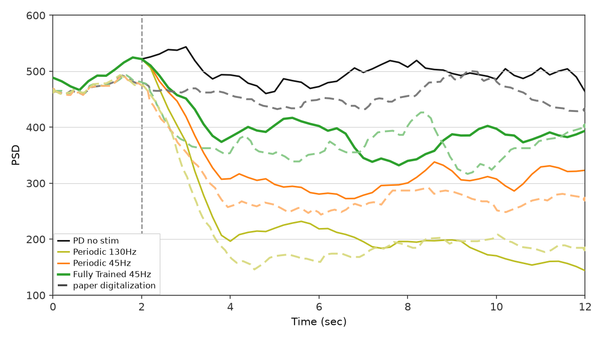 |

**Notes:** Uses an action space of 40 irregular patterns (the regular pattern is excluded from training) and the same trailing-window biomarker sampling as Fig. 2a. Seed 0.

---

## Fig. 5b: Trained policy vs periodic stimulation @ 30 Hz

**Paper claim:** **Periodic 30 Hz** stimulation *raises* beta (30 Hz sits inside the beta band), while the **trained irregular pattern** lowers beta below both no stimulation and periodic 30 Hz.

**What I checked:** Three conditions on the same 12 s protocol; trained < no stim < periodic 30 Hz after onset.

| Paper | My replication |
|:-----:|:---------------:|
|  | 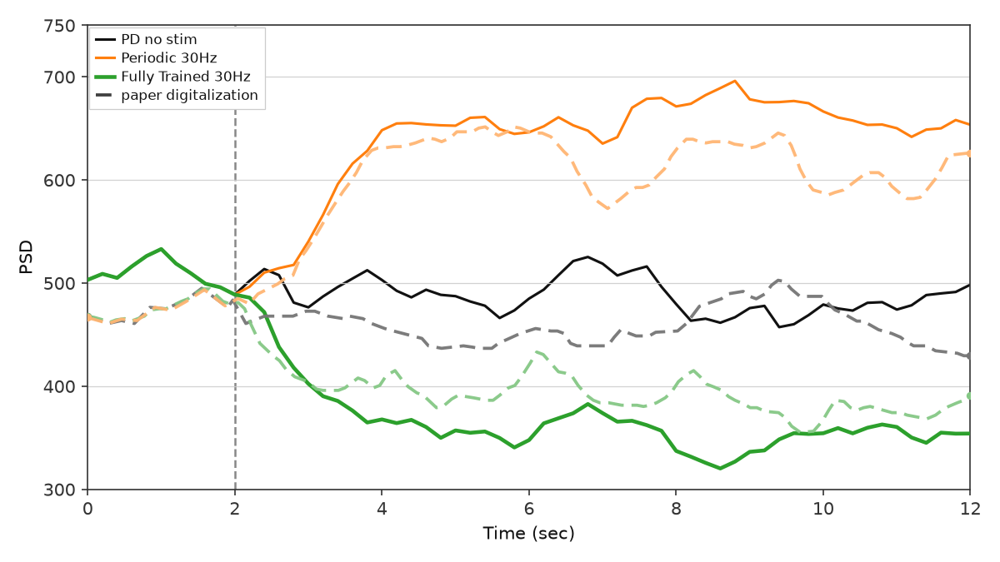 |

**Notes:** Trained with a burst-pattern alphabet (seed 0). The learned policy settles on a single constant pattern that happens to be a strong open-loop beta suppressor; that still satisfies this panel, but it is not the adaptive behavior the paper implies.

<div style="page-break-after: always;"></div>

## Fig. 6a: Quantized policies @ 45 Hz

**Paper claim:** Post-training quantization (int8 and fp16) of the 45 Hz policy **keeps** the full-precision beta suppression, while the QAT-trained policy stays high.

**What I checked:** Four series (fp32, PTQ int8, PTQ fp16, QAT) on the same 12 s protocol; PTQ tracks fp32, QAT sits above, and the traces are genuinely distinct.

| Paper | My replication |
|:-----:|:---------------:|
|  | 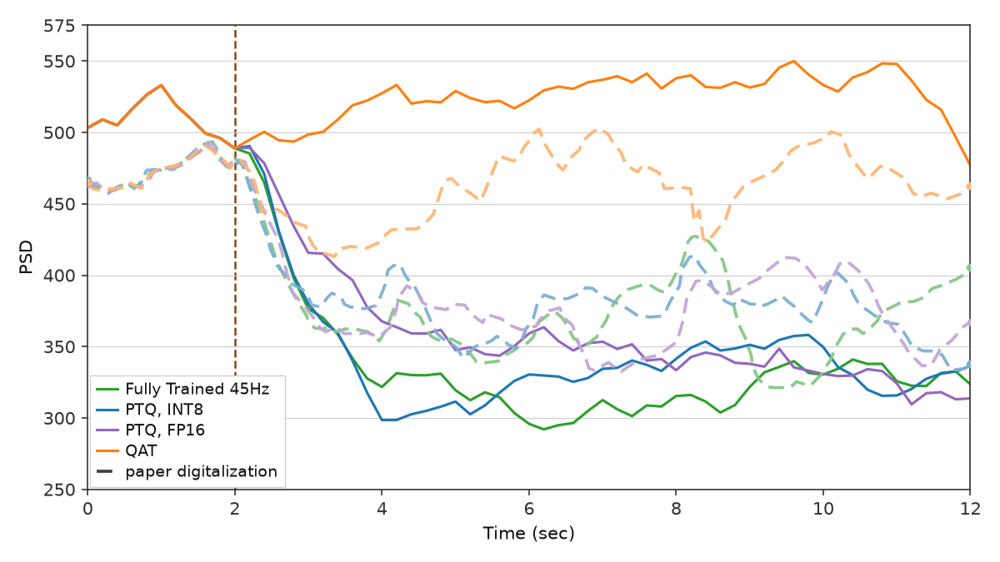 |

**Notes:** Honest evaluation (no display stylization). The quantized policies don't always pick the same action as fp32, but they land at similar suppressed levels.

---

## Fig. 6b: Quantized policies @ 30 Hz

**Paper claim:** Same split as Fig. 6a for the 30 Hz model: PTQ tracks fp32 suppression; QAT remains high.

**What I checked:** Same four-series layout and ordering as Fig. 6a.

| Paper | My replication |
|:-----:|:---------------:|
|  | 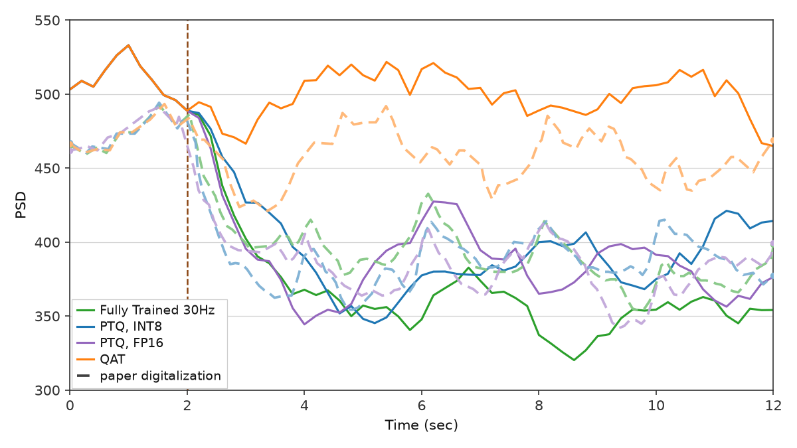 |

<div style="page-break-after: always;"></div>

# Part 2: Nguyen et al.

**Closed-Loop Neuromorphic Deep Brain Stimulation using Deep Spiking Q-Networks.** A deep spiking Q-network (DSQN) adjusts DBS amplitude, frequency, and pulse width every 100 ms from spike observations, using GPi α–β (7–35 Hz) power as feedback.

## Fig. 3: GPi α–β power distribution

**Paper claim:** α–β oscillation power is distributed **higher** in the parkinsonian (PD On) state than in the healthy (PD Off) state, with no stimulation.

**What I checked:** Distribution **ordering** across 500 samples of 100 ms each.

| Paper | My replication |
|:-----:|:---------------:|
| 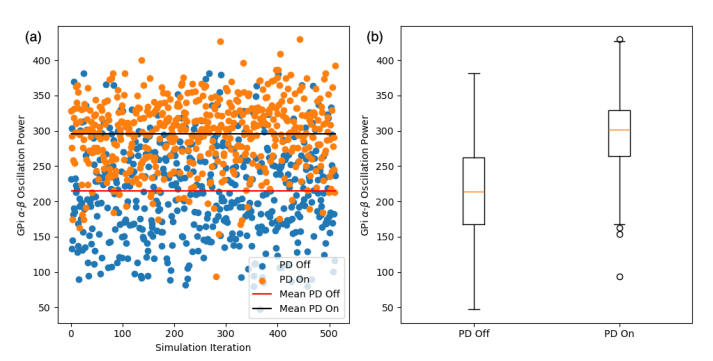 | 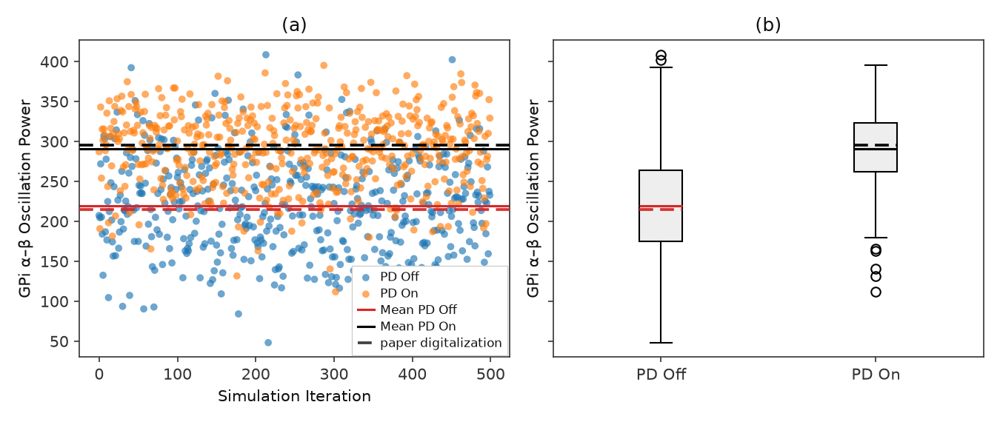 |

**Notes:** PD On mean about 291 vs PD Off about 220 (arbitrary PSD units).

---

## Fig. 7: Evaluation of the trained policy

**Paper panel:** A seeded evaluation of the trained DSQN: **50 episodes** of 25 steps each, with a different seed per episode.

**What I checked:** The same evaluation protocol, with the α–β level and spread across episodes compared against the paper panel.

| Paper | My replication |
|:-----:|:---------------:|
| 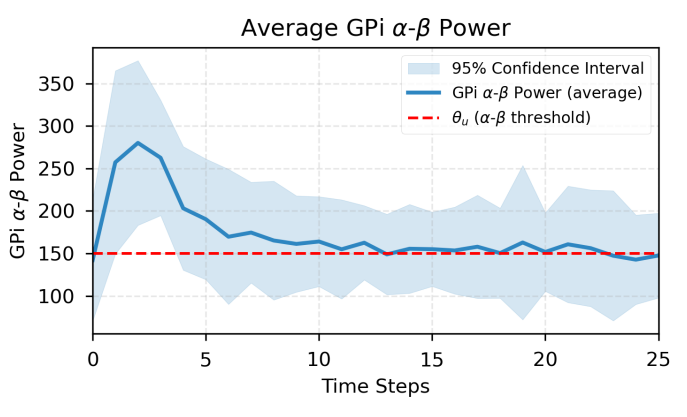 | 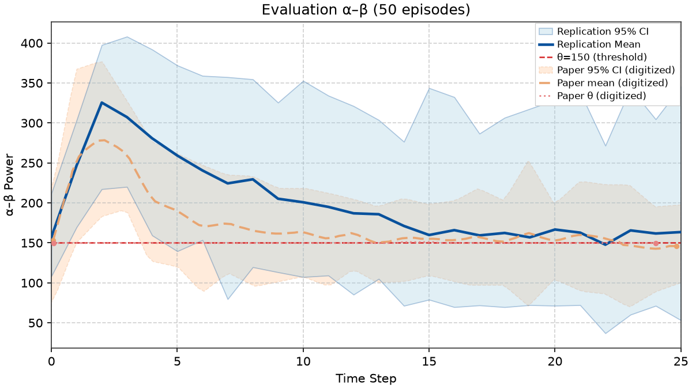 |

**Open panels (Figs 4–6):** the 500-episode training curves (reward and episode length, spike counts and stimulation energy, α–β and stimulation parameters) have the right overall shape but don't yet match the paper's timing closely enough to pass. Latest attempts are in the [Nguyen tracker](https://github.com/nynxlabs/rl-adaptive-dbs/blob/main/figures/nguyen/replications.md).

<div style="page-break-after: always;"></div>

# Part 3: Ravivarapu et al.

**Sample-Efficient Reinforcement Learning Controller for Deep Brain Stimulation in Parkinson's Disease (SEA-DBS).** An actor-critic that picks binary pulse actions every 2 ms, adding a **predictive reward model (PM)** and **Gumbel-Softmax exploration (GS)** on top of a DDPG baseline.

## Fig. 4a: Training beta PSD vs episode

**Paper claim:** SEA-DBS shows a **more pronounced and consistent** beta suppression over training episodes; the Baseline declines only modestly.

**What I checked:** SEA-DBS below Baseline over training, with the trend shapes compared against the digitized paper curves.

| Paper | My replication |
|:-----:|:---------------:|
| 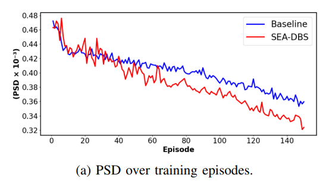 | 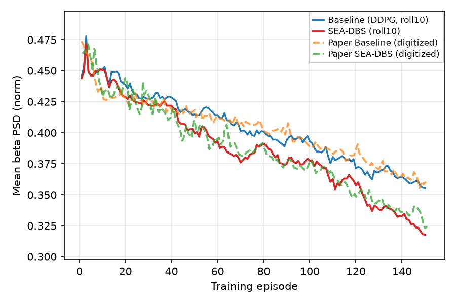 |

**Notes:** Displayed with a 10-episode rolling mean; gates run on the raw per-episode values.

---

## Fig. 4b: Training reward vs episode

**Paper claim:** SEA-DBS reaches **higher** rewards with a **faster** early rise than the Baseline.

| Paper | My replication |
|:-----:|:---------------:|
| 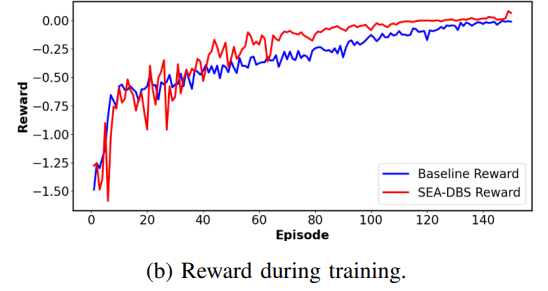 | 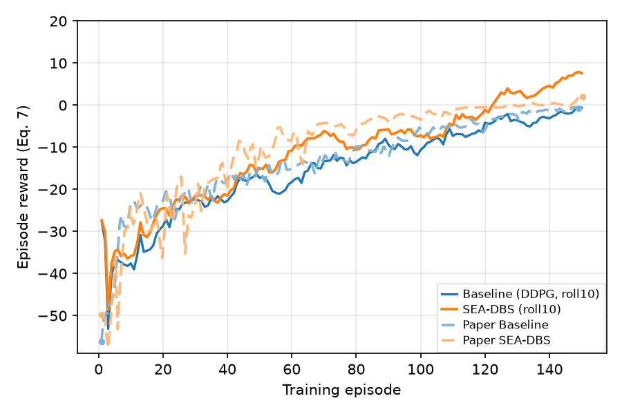 |

<div style="page-break-after: always;"></div>

## Fig. 5a and 5b: Inference at 50 Hz and 30 Hz

**Paper claim:** After training, SEA-DBS lowers PSD **below** the Baseline at both carrier frequencies. The **50 Hz** carrier (above the beta band) works **better** than **30 Hz** (inside it).

**What I checked:** SEA-DBS below Baseline in both panels, at the paper's fixed carrier frequencies.

| Paper | My replication |
|:-----:|:---------------:|
| 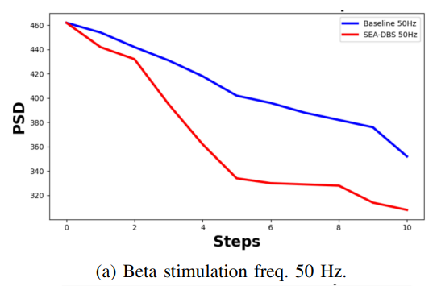 |  |
| 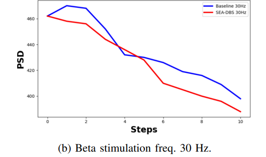 | 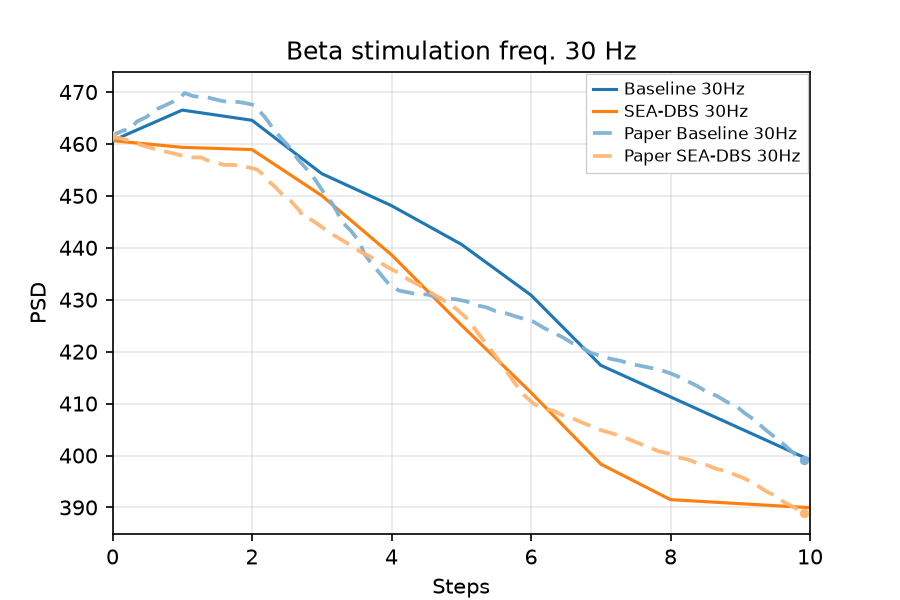 |

---

## Fig. 6: FP16 post-training quantization @ 50 Hz

**Paper claim:** The fp16-quantized SEA-DBS **tracks** the full-precision PSD reduction and still beats the Baseline, at about half the model size.

| Paper | My replication |
|:-----:|:---------------:|
| 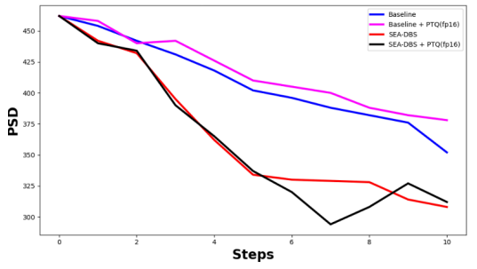 |  |

**Notes:** My checkpoint shrinks from about 0.6 MB to 0.3 MB (the paper reports about 65 MB to 33 MB for its larger network); the halving is what matters here.

---

## Fig. 7: Ablation

**Paper claim:** Full SEA-DBS (PM + GS) gives the strongest, most stable suppression; PM alone is noisy early, and GS alone gives limited gains.

| Paper | My replication |
|:-----:|:---------------:|
| 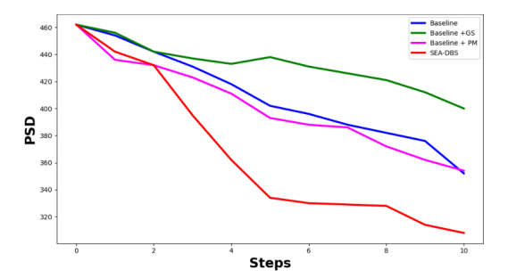 |  |

<div style="page-break-after: always;"></div>

## How this was produced

1. **Plant.** Kumaravelu et al. (2016) CBGT model (MATLAB reference + native Python port); GPi beta biomarker per Mehregan Eq. (1), 13-35 Hz.
2. **Environment.** Gymnasium-style 2 s steps, reward Eq. (8), fixed-mean pulse-pattern alphabet at 45 Hz for the Mehregan training panels. Nguyen (100 ms steps, spike observations) and Ravivarapu (2 ms steps, binary pulses) connect to the same plant through adapters.
3. **Controllers.** One per paper: DDPG (Mehregan), deep spiking Q-network (Nguyen), and SEA-DBS (Ravivarapu), with hyperparameters taken from each paper where reported.
4. **Validation.** Qualitative gates (ordering, onset timing, training shape), compared against digitized paper curves where available, documented in the per-paper trackers and [replication-fidelity.md](https://github.com/nynxlabs/rl-adaptive-dbs/blob/main/docs/development/replication-fidelity.md).

**Reproduce any panel:**

```bash
git clone https://github.com/nynxlabs/rl-adaptive-dbs.git
cd rl-adaptive-dbs

uv run python scripts/figures/papers/mehregan/1b/plot.py   # Mehregan Fig. 1b
uv run python scripts/figures/papers/mehregan/2a/plot.py   # Mehregan Fig. 2a
uv run --group figures python scripts/figures/papers/mehregan/2b/plot.py   # Mehregan Fig. 2b
uv run python scripts/figures/papers/mehregan/4a/plot.py   # Mehregan Fig. 4a (long run)
uv run python scripts/figures/papers/mehregan/4b/plot.py --plot-only   # Mehregan Fig. 4b from 4a cache
```

Every panel has its own `scripts/figures/papers/<paper>/<panel>/plot.py`; `--plot-only` replots from a cached run. The trackers list the exact command for each.

**Environment:** I ran these on my local checkout with `uv`. I have **not** recently re-checked `scripts/setup.sh` on a clean machine; if you try to reproduce and hit install issues, I'm happy to help.

---

## What's next

| Panel set | Topic | Status |
|-----------|-------|--------|
| Nguyen Figs 4–6 | DSQN training curves, spikes + DBS energy, α–β + DBS parameters | Open — [figures/nguyen/replications.md](../../figures/nguyen/replications.md) |
| Cross-controller benchmarking | All three controllers on the same plant metrics | Planned — [docs/benchmarking.md](../benchmarking.md) |
