# Mehregan et al. — figure comparisons

**Primary replication tracker** for this repo. Work is scheduled by **panel**, not by roadmap phase: each row below is an exit criterion with automated gates in `plot.py` (manifest `gates` / `gates_pass`), a committed `plot.py`, and side-by-side PNGs.

Side-by-side **paper panel** vs **our replication**. Plot scripts write replication PNGs to `figures/mehregan/images/`; JSON caches to `artifacts/figures/papers/`. Per-panel gate tables show live **Pass** per check (all required; refreshed by `scripts/digitization/mehregan_gate_status.py` on promote / `--plot-only`).

<!-- summary:start -->
| Panel | Description | Status |
|-------|-------------|--------|
| Fig 1b | GPi PSD | Pass |
| Fig 2a | GPi $P_\beta$ time series | Pass |
| Fig 2b | Error Index time series | Pass (rep v16) |
| Fig 4a | Training $P_\beta$ vs step | Pass (paper Alg. 1, rep v42) |
| Fig 4b | Training reward vs episode | Pass (paired to 4a, rep v49) |
| Fig 5a | Post-train efficacy @ 45 Hz | Pass (closed loop, Fig 4a model, rep v24) |
| Fig 5b | Post-train efficacy @ 30 Hz | Pass (closed loop, burst alphabet, rep v25) |
| Fig 6a | PTQ / QAT @ 45 Hz | Fail (`qat_elevated_vs_fp32`, QAT tie-break lands on regular pattern, rep v63) |
| Fig 6b | PTQ / QAT @ 30 Hz | Pass (closed loop, rep v42) |
<!-- summary:end -->

Replication PNGs: `figures/mehregan/images/`. JSON caches: `artifacts/figures/papers/`. Paper crops: `figures/mehregan/images/<panel>/paper.png` (from paper-note embeds; composite Figs 1/2/4/5/6 split into panels). Full composites under `figures/mehregan/images/_full/`.

---

## Fig 1b — GPi PSD

Mean GPi multitaper power spectral density (1–50 Hz) for three conditions: **healthy control**, **PD no treatment**, and **PD + 130 Hz STN cDBS**. Ordering gate: **PD > healthy** on beta power and **130 Hz cDBS < PD** (see [plant.md](../../docs/plant.md)).

### Paper (Mehregan et al.)

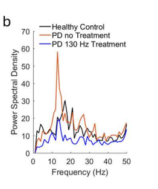

### Replication

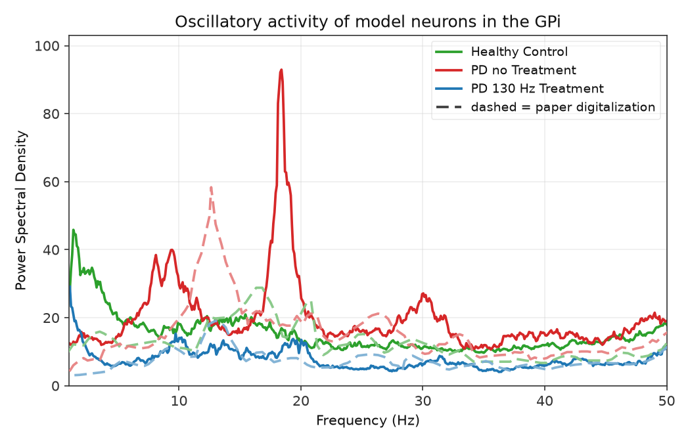

<!-- caption-1b:start -->
**Caption:** see manifest

**Manifest:** `artifacts/figures/papers/mehregan/1b/manifest.json`
<!-- caption-1b:end -->

**Status:** Pass — condition ordering and beta-peak shape match the paper panel (seeds `0–9` mean).

<!-- gates-1b:start -->
**Gates set** (`fig1b_gates` → manifest `gates` / `gates_pass`). Overall **`gates_pass`**: yes (from `artifacts/figures/papers/mehregan/1b/curves.json`, 2026-10-06). Every row is required for exit.

| Key | Description | Pass |
|-----|-------------|------|
| `pd_gt_healthy` | beta-band PD > healthy | yes |
| `pd_130_lt_pd` | 130 Hz cDBS < untreated PD | yes |
| `suppression_ratio_near_paper` | pd_130/pd ratio vs digitized paper | yes |
| `healthy_beta_near_paper` | healthy level within 30% of paper | yes |
| `pd_130hz_beta_near_paper` | treated level within 30% of paper | yes |
<!-- gates-1b:end -->

**Run:**

```bash
uv run python scripts/figures/papers/mehregan/1b/plot.py
uv run python scripts/figures/papers/mehregan/1b/plot.py --plot-only
```

**Defaults:** seeds `0–9` (mean PSD), 10 s segment, Python plant.

---

## Fig 2a — GPi $P_\beta$ time series

GPi beta-band power ($P_\beta$, Eq. 1, 13–35 Hz) over **12 s**: **PD no treatment** (red) vs **PD + 130 Hz cDBS** (blue). Shared baseline 0–2 s; dashed vertical at **2 s** (cDBS onset for blue). After onset, blue falls to a low plateau; red stays elevated.

### Paper (Mehregan et al.)

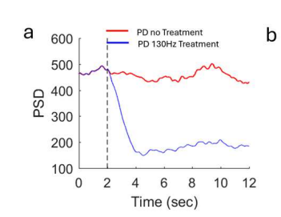

### Replication

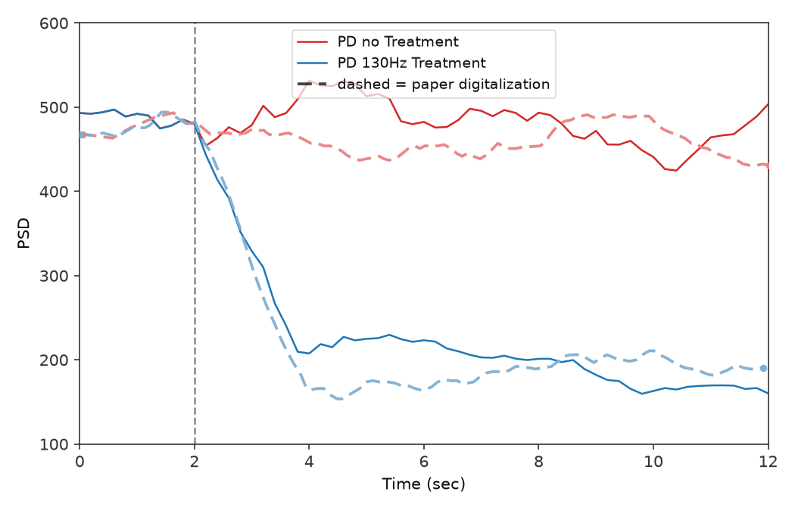

<!-- caption-2a:start -->
**Caption:** 14 s sim (2 s pre-roll), plot = sim − 2 s, 0.2 s trailing / 2 s window (end sim 14 s), seed 0 (2026-08-12)

**Manifest:** `artifacts/figures/papers/mehregan/2a/manifest.json`
<!-- caption-2a:end -->

**Status:** Pass — blue-below-red after $t=2$, shared 0–2 s baseline, dense trailing protocol. Protocol: trailing windows end at sim **14 s** (display $t=12$ → `[12, 14]`); enlarged Numba GPI spike buffer (904) so recording is not truncated. Remaining polish: blue floor slightly below paper at $t=12$; single seed (0). Legend lower left with condensed paper overlay. **Ship image:** unversioned `beta_power.png` (Report 3 gallery).

<!-- gates-2a:start -->
**Gates set** (`fig2_time_gates`, panel `2a`). Overall **`gates_pass`**: yes (from `artifacts/figures/papers/mehregan/2a/series.json`, 2026-10-06). Every row is required for exit.

| Key | Description | Pass |
|-----|-------------|------|
| `prestim_shared` | treated/untreated agree pre-onset (≤5% rel) | yes |
| `treated_below_untreated_late` | cDBS below no-treatment after t=2 | yes |
| `late_ratio_near_paper` | late treated/untreated ratio vs digitization | yes |
| `suppression_drop_near_paper` | drop magnitude vs digitization | yes |
<!-- gates-2a:end -->

**Run:**

```bash
uv run python scripts/figures/papers/mehregan/2a/plot.py
uv run python scripts/figures/papers/mehregan/2a/plot.py --plot-only
uv run python scripts/figures/papers/mehregan/2a/plot.py --sampling segment
```

**Defaults:** seed `0`, 0.2 s trailing samples, 2 s overlapping window, 14 s integrate with 2 s pre-roll. Ship PNG: **`beta_power.png`** (Report 3; not versioned).

---

## Fig 2b — Error Index time series

Windowed Error Index (EI, Eq. 2) over **12 s** with **So-style SMC pulses into TH** (path A): BoC inverse-gamma on **Iappth**, `iappth_baseline=0`, `ggith=0.112`. **PD no treatment** (red) vs **PD + 130 Hz cDBS** (blue). Same timing as Fig 2a. Y-axis **Error Index** (replication default **0.10–0.4**; paper panel reads ~0–0.4).

### Paper (Mehregan et al.)

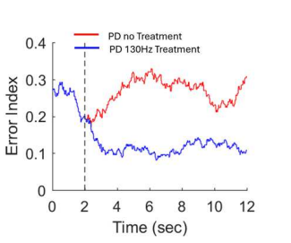

### Replication

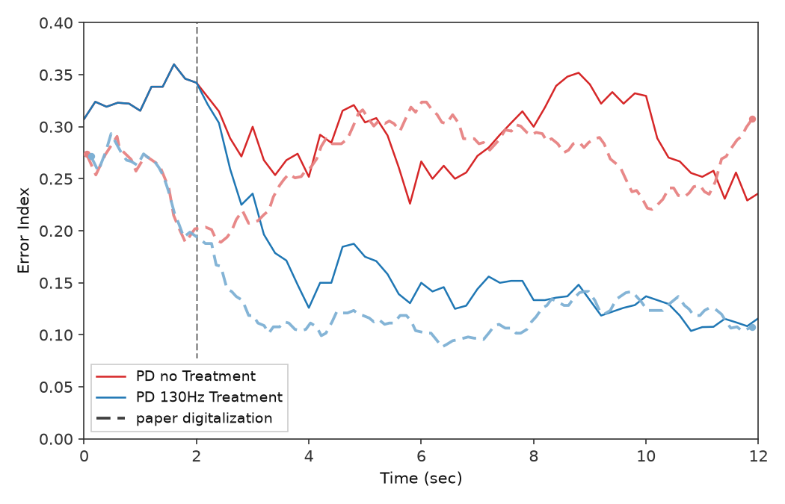

<!-- caption-2b:start -->
**Caption:** 14 s sim (2 s pre-roll), plot = sim − 2 s, 0.2 s trailing / 2 s EI window (end sim 14 s), SMC BoC inv-gamma Iappth, backend python, seed 0, v16 (2026-08-10)

**Manifest:** `artifacts/figures/papers/mehregan/2b/manifest.json`
<!-- caption-2b:end -->

**Status:** Pass — blue-below-red after $t=2$, shared baseline, blue floor ~0.12 near paper. Remaining polish: red $t=12$ slightly low (~0.24 vs ~0.30); single seed.

<!-- gates-2b:start -->
**Gates set** (`fig2_time_gates`, panel `2b`). Overall **`gates_pass`**: yes (from `artifacts/figures/papers/mehregan/2b/series.json`, 2026-10-06). Every row is required for exit.

| Key | Description | Pass |
|-----|-------------|------|
| `prestim_shared` | treated/untreated agree pre-onset (≤5% rel) | yes |
| `treated_below_untreated_late` | cDBS below no-treatment after t=2 | yes |
| `late_ratio_near_paper` | late treated/untreated ratio vs digitization | yes |
| `suppression_drop_near_paper` | drop magnitude vs digitization | yes |
<!-- gates-2b:end -->

**Run:**

```bash
uv run --group figures python scripts/figures/papers/mehregan/2b/plot.py
uv run --group figures python scripts/figures/papers/mehregan/2b/plot.py --plot-only
```

Each run writes a new ``figures/mehregan/images/2b/error_index_vN.png`` (N auto-increments) and updates the replication image link above.

**Defaults:** seed `0`, `smc_site='thalamic'`, `iappth_baseline=0`, `ggith=0.112`, `smc_amplitude=3.5`, `smc_schedule='boc'`, `smc_pulse_source='drive'`, backend **python**.

### Convention (path A, 2026-07-12)

**Citations (split roles):** Gao et al. (ICCPS 2020) define the **EI metric** Mehregan uses (exactly one TH spike in $(\mathrm{SMC}_\tau,\mathrm{SMC}_\tau{+}25\,\mathrm{ms})$; windowed $T_\omega{=}2\,\mathrm{s}$). So et al. (2012) define the **TH drive** for that metric (SMC current pulses into TH; TH not spontaneously active). Kumaravelu replaced those pulses with constant $I_{\mathrm{appth}}=1.2$; Fig 2b restores So-style drive: **pulses only** (`iappth_baseline=0`) plus BoC inverse-gamma timing (~14 Hz mean). Cortical `Iappco` SMC remains available but does **not** produce paper ordering (no Cor→TH synapse). Sweep: `artifacts/probes/fig2b_ei_so_path_a_sweep.json`.

---

## Fig 4a — training beta power vs step

Per-step GPi beta-band power during DDPG training of the **45 Hz** model (§IV.A.1): **300** environment steps (10 episodes × 30 steps of 2 s). Y-axis **PSD(x10³)** = raw $P_\beta / 1000$. This run is the paper's one 45 Hz model: the same checkpoint feeds Fig 4b, Fig 5a and Fig 6a.

### Paper (Mehregan et al.)

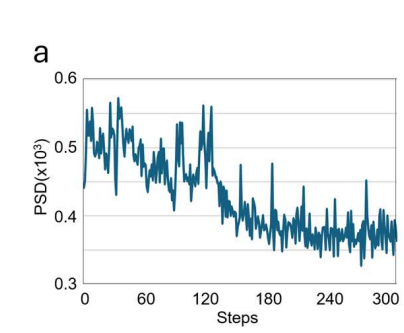

### Replication

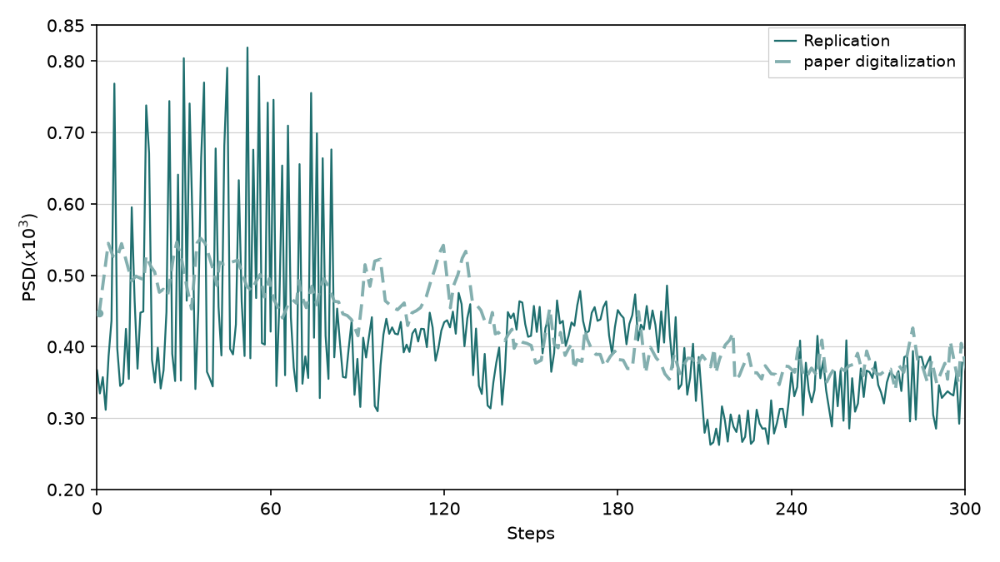

<!-- caption-4a:start -->
**Caption:** 45 Hz, paper Alg. 1 (critic on logits, lr 5e-4/1e-3), burst alphabet, logit noise σ=1, seed 0, v42, ep0=0.444, early=0.462 late=0.365 (2026-10-06)

**Manifest:** `artifacts/figures/papers/mehregan/4a/manifest.json`
<!-- caption-4a:end -->

**Status:** Pass — Algorithm 1 as written (critic on $a_{\mathrm{logit}}$, actor lr $5\times10^{-4}$, critic lr $10^{-3}$, buffer 8192, batch 32, no entropy / warmup extras), raw per-step trace (no display smoothing). Ep0 0.444 vs paper 0.507 (seed spread 0.43–0.55), late 0.365 vs 0.380. Recipe, audit table and paper-silent conventions: [4a.md](../../docs/figures/mehregan/4a.md) § Paper-faithful recipe.

<!-- gates-4a:start -->
**Gates set** (`fig4a_gates` → live `series.json`). Overall **`gates_pass`**: yes (from `artifacts/figures/papers/mehregan/4a/series.json`, 2026-10-06). Every row is required for exit.

| Key | Description | Pass |
|-----|-------------|------|
| `plot_style` | 300 training steps | yes |
| `overall_trend_down` | end window mean < start window mean | yes |
| `drop_vs_paper` | drop ≥ 70% of digitized paper drop | yes |
| `late_early_ratio_near_paper` | late/early ratio vs digitization | yes |
| `mid_fade_vs_paper` | mid [120,150] fade ≥ 50% of paper mid-drop | yes |
| `ep0_near_paper` | steps 0–29 mean within 15% of digitized paper ep0 (seed spread) | yes |
<!-- gates-4a:end -->

**Run:**

```bash
uv run python -m rl_adaptive_dbs.run scripts/figures/papers/mehregan/4a/plot.py --export-notes --update-report
uv run python -m rl_adaptive_dbs.run scripts/figures/papers/mehregan/4a/plot.py --plot-only --export-notes --update-report
```

**Defaults:** seed `0`, 45 Hz `BurstPatternAlphabet`, logit-noise exploration σ = 1.0, init bias 0, plant state carried across each episode's 2 s steps, `plant.dt_ms=0.02`. Paper-silent knobs: `--set FIELD=VALUE` (`alphabet`, `jitter_fraction`, `logit_noise_std`, `init_bias_scale`, `gamma`, `tau`). Writes `series.json` + `checkpoint.pt` (fp32 actor for Fig 5a / 6a).

---

## Fig 4b — training reward vs episode

Episode **total reward** and **episode-mean PSD(x10³)** of the same **45 Hz** training run as Fig 4a (§IV.A.1), episodes **0–8**: reward rises from about **−80** toward **0**, episode-mean PSD falls ~0.50 → ~0.37. Plotted as two panels.

### Paper (Mehregan et al.)

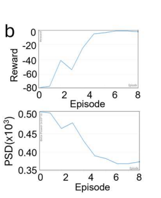

### Replication

**Reward vs episode**

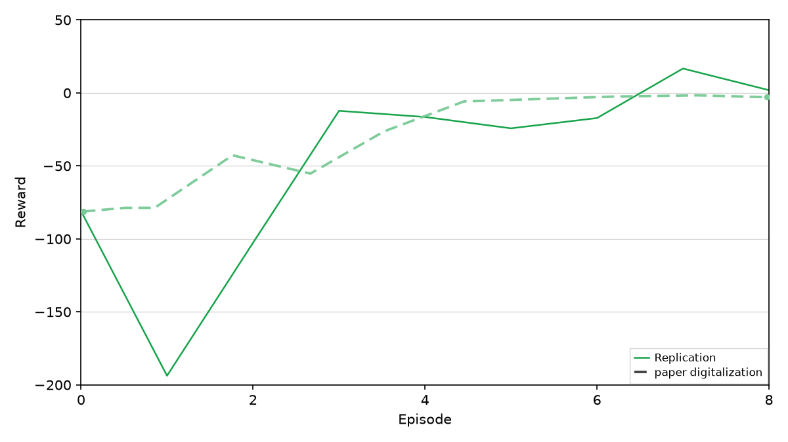

**Episode-mean PSD vs episode**

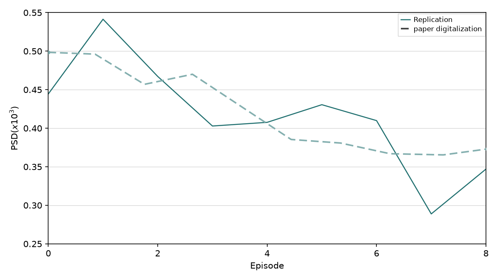

<!-- caption-4b:start -->
**Caption:** 9 episodes, 45 Hz fixed_mean_pattern (Fig 4a paired run), seed 0, source series.json, v49, reward ep0=-81.0 ep8=1.9, rise_ep=3, psd 0.444→0.347, gate pass (2026-10-06)

**Manifest:** `artifacts/figures/papers/mehregan/4b/manifest.json`
<!-- caption-4b:end -->

**Status:** Pass — paired to Fig 4a `series.json`. Reward −81 → late +0.5 (paper −81 → −2.4); episode-mean PSD 0.444 → late 0.349 (paper 0.498 → 0.368). Details: [4b.md](../../docs/figures/mehregan/4b.md).

<!-- gates-4b:start -->
**Gates set** (`fig4b_gates` → manifest `summary.gates`). Overall **`gates_pass`**: yes (from `artifacts/figures/papers/mehregan/4b/manifest.json`, 2026-10-06). Every row is required for exit.

| Key | Description | Pass |
|-----|-------------|------|
| `early_negative` | mean reward ep 0–2 < 0 | yes |
| `reward_rises` | late mean reward > early mean | yes |
| `late_plateau_improved` | late mean reward > −10 | yes |
| `rise_timing` | reward exceeds ep0 + 10 by ep ≤ 6 | yes |
| `beta_drops` | late episode-mean PSD < early | yes |
| `beta_drop_ratio_near_paper` | PSD late/early ratio vs digitization | yes |
| `reward_recovers_like_paper` | qualitative rise (not magnitude match) | yes |
| `late_beta_near_paper` | late PSD within 15% of digitized paper | yes |
| `late_reward_near_zero` | late mean reward in (−10, 2] (paper ~−2) | yes |
| `ep0_beta_near_paper` | episode 0 PSD within 15% of digitized paper (seed spread) | yes |
| `plot_style` | ≥ 2 episodes plotted | yes |
<!-- gates-4b:end -->

**Run:**

```bash
uv run python -m rl_adaptive_dbs.run scripts/figures/papers/mehregan/4b/plot.py --export-notes --update-report
```

**Defaults:** 9 episodes from Fig 4a `artifacts/figures/papers/mehregan/4a/series.json` (replot only; trains via Fig 4a).

---

## Fig 5a — post-train efficacy @ 45 Hz

Post-training evaluation of the **45 Hz** model (§IV.A.2) on a fixed seed: 2 s reset, then five 2 s steps of the trained policy, **closed loop** (each step plays $\arg\max$ of the actor on the previous step's $P_\beta$). Same seed for **PD no stim**, **fully trained 45 Hz**, **periodic 45 Hz** and **periodic 130 Hz**. Trace = trailing 2 s $P_\beta$ every 0.2 s (Fig 2a protocol). Paper: trained reduces beta vs no stim; periodic 45 Hz and 130 Hz are lower still.

### Paper (Mehregan et al.)

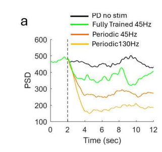

### Replication

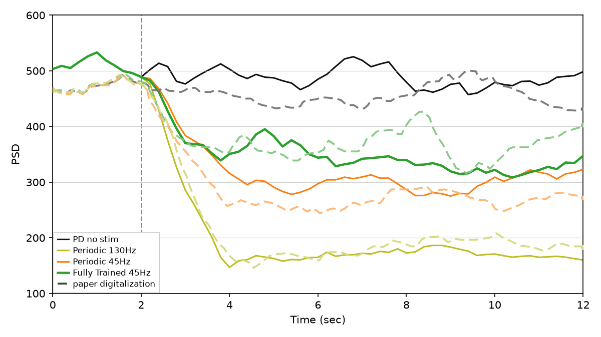

<!-- caption-5a:start -->
**Caption:** 45 Hz paper-protocol eval, seed 0, checkpoint=checkpoint.pt, 0.2s trailing, v24, trained_mean=339, no_stim_mean=486, periodic_mean=299, trained>periodic, gates pass (2026-10-06)

**Manifest:** `artifacts/figures/papers/mehregan/5a/manifest.json`
<!-- caption-5a:end -->

**Status:** Pass — evaluates the Fig 4a checkpoint (the paper's one 45 Hz model). The policy settles on burst pattern 4: trained 339, periodic 45 Hz 299, no stim 486, 130 Hz 169 (late means, t ≥ 4 s). The faithful agent does not find the regular pattern in 10 episodes, so trained > periodic without the former `skip_regular` action-space removal.

<!-- gates-5a:start -->
**Gates set** (`fig5a_pass` / `fig5_efficacy_gates` → manifest `gates`). Overall **`pass`**: yes (from `artifacts/figures/papers/mehregan/5a/manifest.json`, 2026-10-06). Every row is required for exit.

| Key | Description | Pass |
|-----|-------------|------|
| `shared_baseline` | no-stim vs periodic pre-onset Δ < 25 | yes |
| `trained_closed_loop` | trained series runs the actor closed loop (no replayed actions) | yes |
| `trained_below_no_stim` | trained mean (t ≥ 4 s) < no stim | yes |
| `trained_above_periodic` | trained > periodic 45 Hz | yes |
| `cdbs_lowest` | 130 Hz cDBS lowest of four series | yes |
| `trained_no_stim_ratio_near_paper` | trained/no-stim late ratio (t ≥ 4 s) vs digitized paper | yes |
| `periodic_no_stim_ratio_near_paper` | periodic/no-stim late ratio (t ≥ 4 s) vs digitized paper | yes |
<!-- gates-5a:end -->

**Run:**

```bash
uv run python -m rl_adaptive_dbs.run scripts/figures/papers/mehregan/5a/plot.py --export-notes --update-report
uv run python -m rl_adaptive_dbs.run scripts/figures/papers/mehregan/5a/plot.py --plot-only --export-notes --update-report
```

**Defaults:** eval seed `0`, checkpoint `artifacts/figures/papers/mehregan/4a/checkpoint.pt`, `BurstPatternAlphabet`. Shared code: `scripts/figures/papers/mehregan/efficacy_panel.py`.

---

## Fig 5b — post-train efficacy @ 30 Hz

Same closed-loop eval for the **30 Hz** model (§IV.A.2), trained with the Fig 4a recipe ("all other parameters fixed"). Series: **PD no stim**, **fully trained 30 Hz**, **periodic 30 Hz**. Paper: periodic 30 Hz *raises* beta (inside the beta band); the trained irregular pattern lowers it below both.

### Paper (Mehregan et al.)

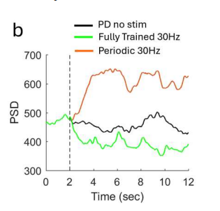

### Replication

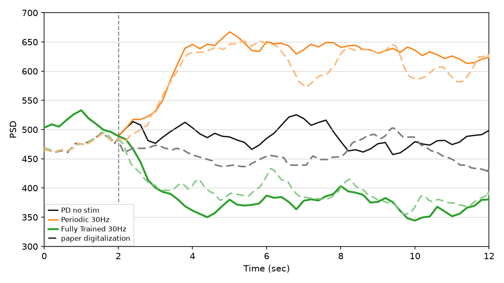

<!-- caption-5b:start -->
**Caption:** 30 Hz paper-protocol eval, seed 0, checkpoint=checkpoint.pt, 0.2s trailing, v25, trained_mean=372, no_stim_mean=486, periodic_mean=638, trained<both, gates pass (2026-10-06)

**Manifest:** `artifacts/figures/papers/mehregan/5b/manifest.json`
<!-- caption-5b:end -->

**Status:** Pass — trained 372 < no stim 486 < periodic 30 Hz 638. The policy settles on burst pattern 4 (60 Hz clusters with silence — instantaneous rate outside the beta band, as the paper argues).

<!-- gates-5b:start -->
**Gates set** (`fig5b_pass` / `fig5_efficacy_gates` → manifest `gates`). Overall **`pass`**: yes (from `artifacts/figures/papers/mehregan/5b/manifest.json`, 2026-10-06). Every row is required for exit.

| Key | Description | Pass |
|-----|-------------|------|
| `shared_baseline` | no-stim vs periodic pre-onset Δ < 25 | yes |
| `trained_closed_loop` | trained series runs the actor closed loop (no replayed actions) | yes |
| `trained_below_no_stim` | trained mean (t ≥ 4 s) < no stim | yes |
| `trained_below_periodic` | trained < periodic 30 Hz | yes |
| `periodic_above_no_stim` | periodic 30 Hz elevates beta vs no stim | yes |
| `trained_no_stim_ratio_near_paper` | trained/no-stim late ratio (t ≥ 4 s) vs digitized paper | yes |
| `periodic_no_stim_ratio_near_paper` | periodic/no-stim late ratio (t ≥ 4 s) vs digitized paper | yes |
<!-- gates-5b:end -->

**Run:**

```bash
uv run python -m rl_adaptive_dbs.run scripts/figures/papers/mehregan/5b/plot.py --train --export-notes --update-report
uv run python -m rl_adaptive_dbs.run scripts/figures/papers/mehregan/5b/plot.py --plot-only --export-notes --update-report
```

**Defaults:** train + eval seed `0`, 30 Hz `BurstPatternAlphabet` (the ±1/3 jitter family has 0/40 irregular 30 Hz patterns below no stim), same paper-silent knobs as Fig 4a. Writes `artifacts/figures/papers/mehregan/5b/checkpoint.pt` (fp32 actor for Fig 6b).

---

## Fig 6a — PTQ / QAT @ 45 Hz

Quantization on the **45 Hz** model (§IV.A.3), same closed-loop eval and seed. **Fully trained** = Fig 4a fp32 checkpoint; **PTQ fp16** = fp16 cast; **PTQ int8** = PyTorch `quantize_dynamic`; **QAT** = separate 10-episode quantization-aware run with the same recipe (fake-quant stub on the input, dequant stub on the logits). Paper: PTQ tracks fp32 suppression; 10-episode QAT does not reduce beta (stays at or above the pre-stim level).

### Paper (Mehregan et al.)

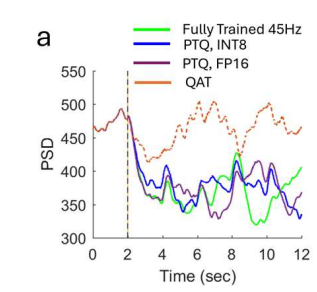

### Replication

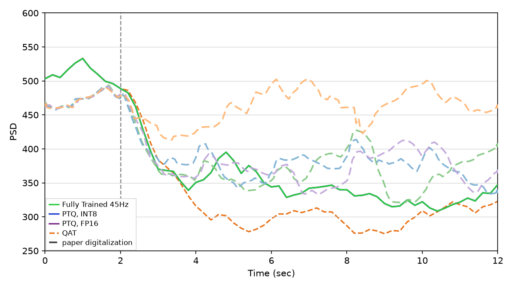

<!-- caption-6a:start -->
**Caption:** 45 Hz paper-protocol eval, seed 0, fp32_post=339, qat_post=299, PTQ tracks fp32, v63, 2026-10-06

**Manifest:** `artifacts/figures/papers/mehregan/6a/manifest.json`
<!-- caption-6a:end -->

**Status:** Fail — `qat_elevated_vs_fp32`, `qat_not_below_paper`. fp32 / PTQ fp16 / PTQ int8 all 339 (paper-like). The QAT run reproduces the paper's mechanism — it never converges in 10 episodes because its logits saturate at the fake-quant clamp — but the deployed $\arg\max$ then breaks a ~20-way tie toward the lowest index, which at 45 Hz is usually the regular train (a strong suppressor, 299). Across training seeds 0–6 that happens in 5/7 (`scripts/probes/mehregan_qat_seeds.py`). Documented gap — no seed picking, alphabet reordering or eval override. See [4a.md](../../docs/figures/mehregan/4a.md) § QAT tie-break.

<!-- gates-6a:start -->
**Gates set** (`fig6_quant_gates` → manifest `gates`). Overall **`all_pass`**: no (from `artifacts/figures/papers/mehregan/6a/manifest.json`, 2026-10-06). Every row is required for exit.

| Key | Description | Pass |
|-----|-------------|------|
| `all_closed_loop` | fp32, PTQ and QAT each run their own actor closed loop | yes |
| `prestim_shared` | all series share the pre-onset level (spread ≤ 1%) | yes |
| `fp32_suppresses_vs_baseline` | fp32 late mean (t ≥ 4 s) < its pre-onset mean | yes |
| `ptq_fp16_near_fp32` | PTQ fp16 late mean within 15% of fp32 | yes |
| `ptq_int8_near_fp32` | PTQ int8 late mean within 20% of fp32 | yes |
| `qat_elevated_vs_fp32` | QAT late mean > fp32 | no |
| `fp32_level_near_paper` | fp32 late/pre within 20% of digitized paper | yes |
| `ptq_fp16_level_near_paper` | PTQ fp16 late/pre within 20% of digitized paper | yes |
| `ptq_int8_level_near_paper` | PTQ int8 late/pre within 20% of digitized paper | yes |
| `qat_not_below_paper` | QAT late/pre ≥ 80% of digitized paper (paper: same range or increased) | no |
| `qat_late_sustained` | QAT [10,12] s mean ≥ 90% of its [2,8] s mean (no late fade) | yes |
<!-- gates-6a:end -->

**Run:**

```bash
uv run python -m rl_adaptive_dbs.run scripts/figures/papers/mehregan/6a/plot.py --train-qat --export-notes --update-report
uv run python -m rl_adaptive_dbs.run scripts/figures/papers/mehregan/6a/plot.py --export-notes --update-report      # re-eval existing QAT checkpoint
uv run python -m rl_adaptive_dbs.run scripts/figures/papers/mehregan/6a/plot.py --plot-only --export-notes --update-report
```

**Defaults:** fp32 `artifacts/figures/papers/mehregan/4a/checkpoint.pt`, QAT `artifacts/figures/papers/mehregan/6a/qat_checkpoint.pt` (train seed `0`), eval seed `0`. Shared code: `scripts/figures/papers/mehregan/quant_panel.py`.

---

## Fig 6b — PTQ / QAT @ 30 Hz

Same quantization panel for the **30 Hz** model (§IV.A.3): Fig 5b fp32 checkpoint, PTQ fp16 / int8, and a 10-episode QAT run with the same recipe.

### Paper (Mehregan et al.)

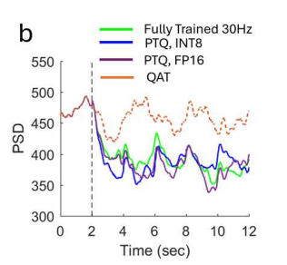

### Replication

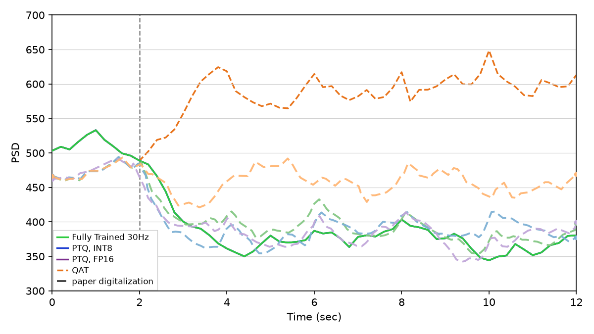

<!-- caption-6b:start -->
**Caption:** 30 Hz paper-protocol eval, seed 0, fp32_post=372, qat_post=594, PTQ tracks fp32, QAT elevated, v42, 2026-10-06

**Manifest:** `artifacts/figures/papers/mehregan/6b/manifest.json`
<!-- caption-6b:end -->

**Status:** Pass — fp32 / PTQ fp16 / PTQ int8 372; QAT 594 (above the pre-stim level; paper: QAT power "stayed at the same range or increased"). As at 45 Hz the QAT logits saturate and the deployed action is a tie-break (here pattern 1, an elevating burst); across seeds 0–6, 4/7 land elevated.

<!-- gates-6b:start -->
**Gates set** (`fig6_quant_gates` → manifest `gates`). Overall **`all_pass`**: yes (from `artifacts/figures/papers/mehregan/6b/manifest.json`, 2026-10-06). Every row is required for exit.

| Key | Description | Pass |
|-----|-------------|------|
| `all_closed_loop` | fp32, PTQ and QAT each run their own actor closed loop | yes |
| `prestim_shared` | all series share the pre-onset level (spread ≤ 1%) | yes |
| `fp32_suppresses_vs_baseline` | fp32 late mean (t ≥ 4 s) < its pre-onset mean | yes |
| `ptq_fp16_near_fp32` | PTQ fp16 late mean within 15% of fp32 | yes |
| `ptq_int8_near_fp32` | PTQ int8 late mean within 20% of fp32 | yes |
| `qat_elevated_vs_fp32` | QAT late mean > fp32 | yes |
| `fp32_level_near_paper` | fp32 late/pre within 20% of digitized paper | yes |
| `ptq_fp16_level_near_paper` | PTQ fp16 late/pre within 20% of digitized paper | yes |
| `ptq_int8_level_near_paper` | PTQ int8 late/pre within 20% of digitized paper | yes |
| `qat_not_below_paper` | QAT late/pre ≥ 80% of digitized paper (paper: same range or increased) | yes |
| `qat_late_sustained` | QAT [10,12] s mean ≥ 90% of its [2,8] s mean (no late fade) | yes |
<!-- gates-6b:end -->

**Run:**

```bash
uv run python -m rl_adaptive_dbs.run scripts/figures/papers/mehregan/6b/plot.py --train-qat --export-notes --update-report
uv run python -m rl_adaptive_dbs.run scripts/figures/papers/mehregan/6b/plot.py --plot-only --export-notes --update-report
```

**Defaults:** fp32 `artifacts/figures/papers/mehregan/5b/checkpoint.pt`, QAT `artifacts/figures/papers/mehregan/6b/qat_checkpoint.pt` (train seed `0`), eval seed `0`.
